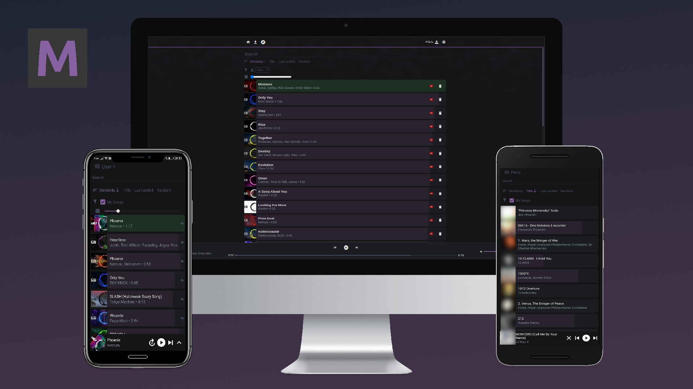

# Musidex
Your musical pokedex, Plex for music.

Add songs from youtube videos or youtube playlist to your library,
or import them from your local files.  
Tags are automatically imported and searchable,
sync it on your phone to enjoy free offline music, managed from your home server.

Don't want to bother making playlists?  
Let Musidex handle it for you, a neural network analyses your musics and checks for similarity
to provide semantic autoplaying.  
Choose a starting point and let it choose the next song for you!

### Demo

Try the demo at:

https://demo.douady.paris/

Please don't mess it up. :)

### Roadmap


- [x] Music streaming
- [x] Youtube import
- [x] Web front
- [x] Neural embedding based auto play
- [x] Text search
- [x] CI
- [x] Multiple accounts
- [x] Android App
- [x] Docker build
- [x] iOS App
- [x] Local download for apps
- [x] Browser extension to add YT videos to library directly from youtube
- [ ] Tag filtering
- [ ] Playlists through tags/Tag editor
- [ ] Basic authentication
- [ ] CD
- [ ] MP3 import
- [ ] Ogg import
- [ ] FLAC import

# Setting up the server

### Using docker

```bash
# Build the image, can take up to 20 minutes depending on your CPU and your network bandwidth
docker build -t musidex .

# Run the container (replace /path/to/musidex with absolute path to Musidex, like $HOME/musidex)
docker run -d -p 80:3200 -v /path/to/musidex/storage:/storage -t musidex 
```

All musidex data (musics, thumbnails, db) ends up in the `storage` directory.

### Linux

Only GNU/Linux distros are supported at the moment.

#### Dependencies

You can run the `prepare.sh` script after cloning to run all of the following commands,
or run them yourself with an explanation.

[Youtube-dl](http://ytdl-org.github.io/youtube-dl/download.html) to add music from youtube URLs.

```bash
sudo curl -L https://yt-dl.org/downloads/latest/youtube-dl -o /usr/local/bin/youtube-dl
sudo chmod a+rx /usr/local/bin/youtube-dl
```

Ffmpeg so that the downloaded audio files are converted to more friendly formats. (as advised by youtube-dl).  
Npm for the frontend.  
Sqlite for the db.
```bash
sudo apt install ffmpeg npm libsqlite3-dev python3 python-is-python3
```

The [rust compiler](https://www.rust-lang.org/tools/install) for the backend.

```bash
curl --proto '=https' --tlsv1.2 -sSf https://sh.rustup.rs | sh -s -- -y
source "$HOME"/.cargo/env
```

The repo itself.

```bash
git clone https://github.com/Uriopass/Musidex
cd Musidex

# Prepare the web dependencies
(cd musidex-web && npm install)
```

#### Building and running

```bash
# Just run the start script
./start.sh
```

# Developing on the project

First install the dependencies as listed above, then

```bash
# Start the daemon, will listen on localhost:3200
cargo run --manifest-path=musidex-daemon/Cargo.toml

# And in another terminal... start the web client
cd musidex-web
npm start # will start on localhost:3000 
          # and proxy api requests to the daemon
```

Then if you want to work on the daemon,
simply run `cargo run` again after doing your modifications.

If you want to work on the web client,
the modifications will be hot reloaded.

All musidex data ends up in the `storage` directory.
